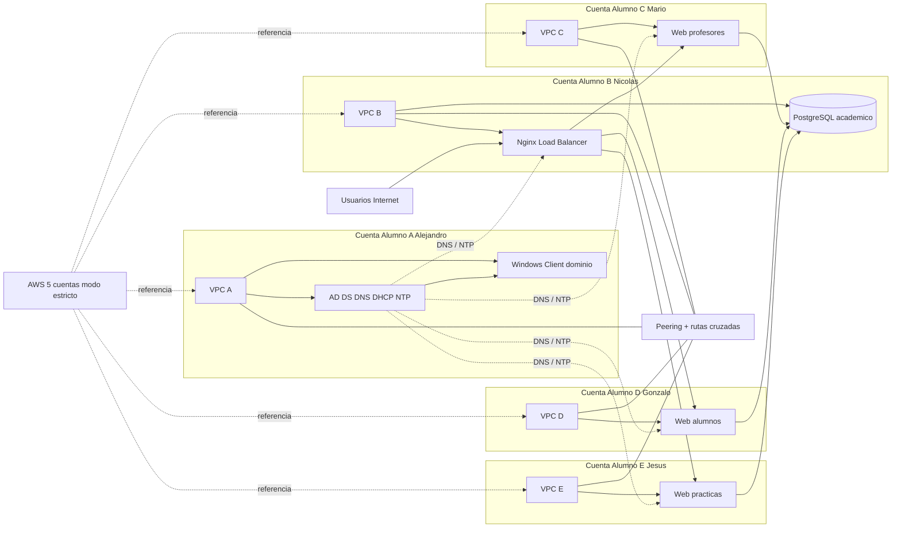
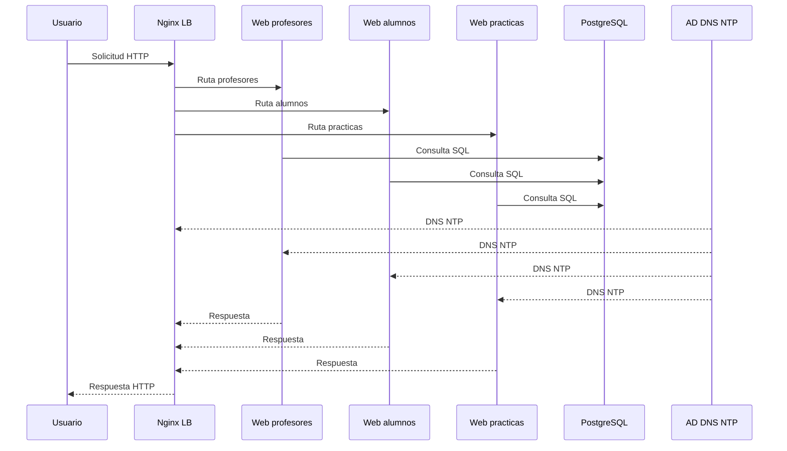

```mermaid
flowchart LR
  Internet[Usuarios Internet]
  AWS_5["AWS 5 cuentas modo estricto"]

  subgraph A["Cuenta Alumno A Alejandro"]
    VPC_A[VPC A]
    AD["AD DS DNS DHCP NTP"]
    WIN["Windows Client dominio"]
    VPC_A --> AD
    VPC_A --> WIN
    AD --> WIN
  end

  subgraph B["Cuenta Alumno B Nicolas"]
    VPC_B[VPC B]
    LB[Nginx Load Balancer]
    DB[(PostgreSQL academico)]
    VPC_B --> LB
    VPC_B --> DB
  end

  subgraph C["Cuenta Alumno C Mario"]
    VPC_C[VPC C]
    WEB1["Web profesores"]
    VPC_C --> WEB1
  end

  subgraph D["Cuenta Alumno D Gonzalo"]
    VPC_D[VPC D]
    WEB2["Web alumnos"]
    VPC_D --> WEB2
  end

  subgraph E["Cuenta Alumno E Jesus"]
    VPC_E[VPC E]
    WEB3["Web practicas"]
    VPC_E --> WEB3
  end

  Internet --> LB
  LB --> WEB1
  LB --> WEB2
  LB --> WEB3

  WEB1 --> DB
  WEB2 --> DB
  WEB3 --> DB

  AD -. DNS / NTP .-> LB
  AD -. DNS / NTP .-> WEB1
  AD -. DNS / NTP .-> WEB2
  AD -. DNS / NTP .-> WEB3

  Peer[Peering + rutas cruzadas]
  VPC_A --- Peer
  VPC_B --- Peer
  VPC_C --- Peer
  VPC_D --- Peer
  VPC_E --- Peer

  AWS_5 -. referencia .-> VPC_A
  AWS_5 -. referencia .-> VPC_B
  AWS_5 -. referencia .-> VPC_C
  AWS_5 -. referencia .-> VPC_D
  AWS_5 -. referencia .-> VPC_E
```

```mermaid
sequenceDiagram
  participant U as Usuario
  participant LB as Nginx LB
  participant W1 as Web profesores
  participant W2 as Web alumnos
  participant W3 as Web practicas
  participant DB as PostgreSQL
  participant AD as AD DNS NTP

  U->>LB: Solicitud HTTP
  LB->>W1: Ruta profesores
  LB->>W2: Ruta alumnos
  LB->>W3: Ruta practicas

  W1->>DB: Consulta SQL
  W2->>DB: Consulta SQL
  W3->>DB: Consulta SQL

  AD-->>LB: DNS NTP
  AD-->>W1: DNS NTP
  AD-->>W2: DNS NTP
  AD-->>W3: DNS NTP

  W1-->>LB: Respuesta
  W2-->>LB: Respuesta
  W3-->>LB: Respuesta
  LB-->>U: Respuesta HTTP
```
