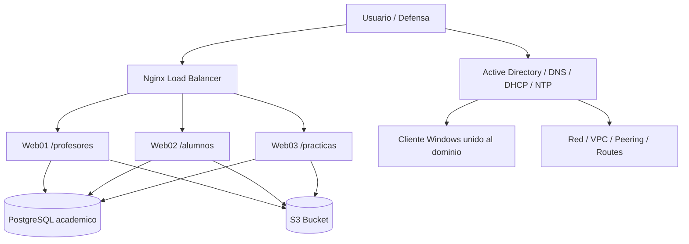

# DRP Integral — Visión general

## Alcance real del DRP

El Plan de Recuperación ante Desastres de la práctica **no está limitado a la base de datos**. Debe cubrir todo el servicio extremo a extremo:

- **Identidad y directorio**: Active Directory, DNS, DHCP, NTP, GPO y cliente Windows.
- **Datos**: PostgreSQL con la base `academico`.
- **Aplicación**: Nginx como balanceador y los servicios Node.js de `/profesores`, `/alumnos` y `/practicas`.
- **Almacenamiento**: S3 y los objetos asociados al proyecto.
- **Red y conectividad**: VPCs, peering, route tables y security groups.
- **Automatización**: CloudFormation, Ansible y scripts de backup/restore.

## Diagrama de arquitectura DRP

### Cómo explicarlo

- El **usuario** entra por el LB.
- El LB reparte a los tres módulos web.
- Las apps consumen la base de datos y S3.
- AD sostiene identidad, DNS, DHCP y sincronización de tiempo.
- La red y el peering son la base que permite que todo se vea entre cuentas.

## Idea de recuperación

La recuperación se plantea por capas:

1. **Reconstruir infraestructura**.
2. **Recuperar identidad y resolución de nombres**.
3. **Restaurar datos persistentes**.
4. **Levantar aplicaciones y balanceo**.
5. **Verificar acceso y evidencias**.

## Qué parte se respalda con qué

| Componente | Estrategia |
|---|---|
| AD / DC01 | System State backup |
| PostgreSQL | Dump lógico programado |
| S3 | Versionado + sincronización/copia secundaria |
| Web/LB | Reprovisión por IaC + Ansible |
| Red | Recreación determinista de VPC, peering y rutas |

## Mensaje clave para defensa

El DRP es válido solo si permite volver a levantar el servicio completo y comprobar que funciona con usuarios reales, rutas reales y datos reales. No basta con tener un backup de la base de datos si el dominio, la red o la aplicación no se pueden reconstruir.
