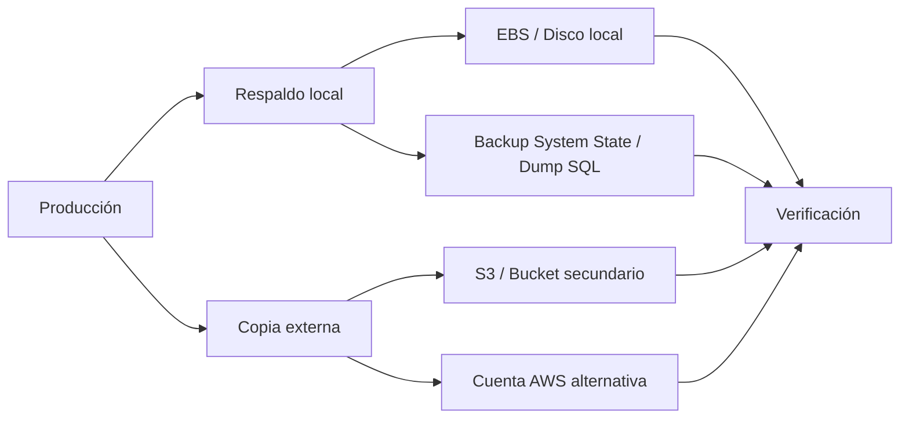

# Estrategia DRP 3-2-1

## Regla 3-2-1

La práctica adopta la estrategia **3-2-1**:

- **3 copias** de la información
- **2 soportes distintos**
- **1 copia fuera del entorno principal**

## Aplicación al proyecto

## Diagrama de la estrategia 3-2-1

### Lectura rápida del diagrama

- **Producción** genera la información activa.
- Una copia queda en respaldo operativo local.
- Otra copia se saca fuera del entorno principal.
- Todo se valida con una restauración real.

### Copia 1 — Producción

Datos activos en los servicios originales:

- DC01 con Active Directory, DNS, DHCP y NTP
- PostgreSQL en el servidor de base de datos
- Aplicaciones Node.js en los web servers
- Objetos y evidencias en S3

### Copia 2 — Respaldo operativo local

Backups rápidos para restauración diaria o ante fallo menor:

- Dump lógico de PostgreSQL en disco local
- Backup de System State de Windows Server
- Exportaciones o copias de objetos S3 para verificación

### Copia 3 — Respaldo fuera del entorno principal

Copia aislada para recuperación ante desastre serio:

- Cuenta AWS alternativa o bucket de recuperación
- Almacenamiento con versionado y/o cifrado
- Copias retenidas con política de inmutabilidad o retención

## Soportes distintos

Para que la estrategia sea válida, no basta con copiar tres veces en el mismo sitio. Aquí combinamos:

- **EBS / disco local** para respaldo operativo
- **S3** para durabilidad y copia externa
- **Cuenta alternativa** o entorno de recuperación para restauración cruzada

## Recomendaciones de seguridad

- Cifrar backups sensibles.
- No guardar contraseñas en claro dentro de scripts.
- Usar IAM con mínimo privilegio.
- Separar backup y restore en roles diferentes si es posible.
- Verificar integridad de archivos antes de restaurar.

## Resultado esperado

Si falla un servidor, una VPC o incluso una cuenta, debe existir al menos una copia limpia que permita reconstruir el servicio con evidencia y sin improvisación.
