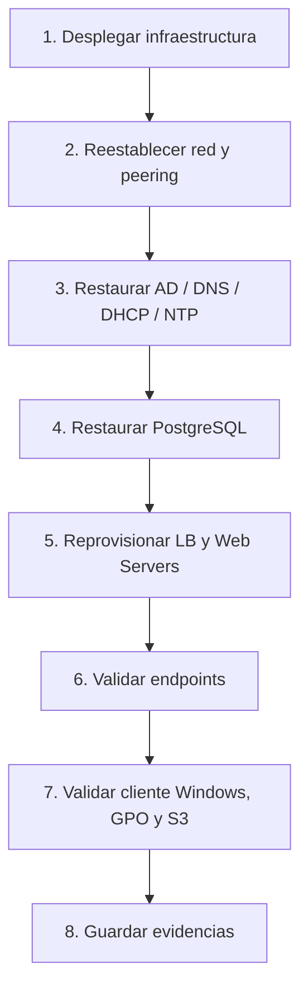

# Restauración end-to-end

## Objetivo

Recuperar la plataforma completa de la práctica con un orden que minimice errores y deje evidencia defendible.

## Orden recomendado de recuperación

## Diagrama del proceso de recuperación

### Cómo contarlo en la defensa

- Primero se recupera la base técnica.
- Después se restaura la identidad y el directorio.
- Luego se recuperan los datos.
- Después se levantan los servicios.
- Al final se demuestra que todo funciona con pruebas reales.

### Fase 1 — Infraestructura base

1. Desplegar la infraestructura mínima con CloudFormation.
2. Verificar VPC, subnets, route tables y security groups.
3. Reestablecer peering y rutas entre cuentas.

### Fase 2 — Active Directory

1. Restaurar System State del DC.
2. Validar DNS, DHCP y NTP.
3. Confirmar OU, usuarios y GPO.

### Fase 3 — Base de datos

1. Restaurar `academico` desde el último dump.
2. Verificar tablas y datos.
3. Comprobar permisos y acceso desde los servicios.

### Fase 4 — Aplicaciones Linux

1. Reprovisionar LB, Web01, Web02 y Web03.
2. Levantar servicios Node.js.
3. Validar Nginx y las locations `/profesores`, `/alumnos` y `/practicas`.

### Fase 5 — Almacenamiento y pruebas finales

1. Validar acceso S3.
2. Probar endpoints.
3. Comprobar autenticación de dominio y acceso al recurso compartido.
4. Guardar capturas y logs.

## Criterios de éxito

- El cliente Windows entra al dominio.
- La base de datos responde con datos reales.
- El balanceador entrega tráfico correctamente.
- S3 está accesible desde el rol IAM correspondiente.

## Señal de que la restauración es válida

Si el sistema vuelve a responder pero no puede ser probado con usuarios reales, consultas reales y tráfico real, todavía no está recuperado del todo.
