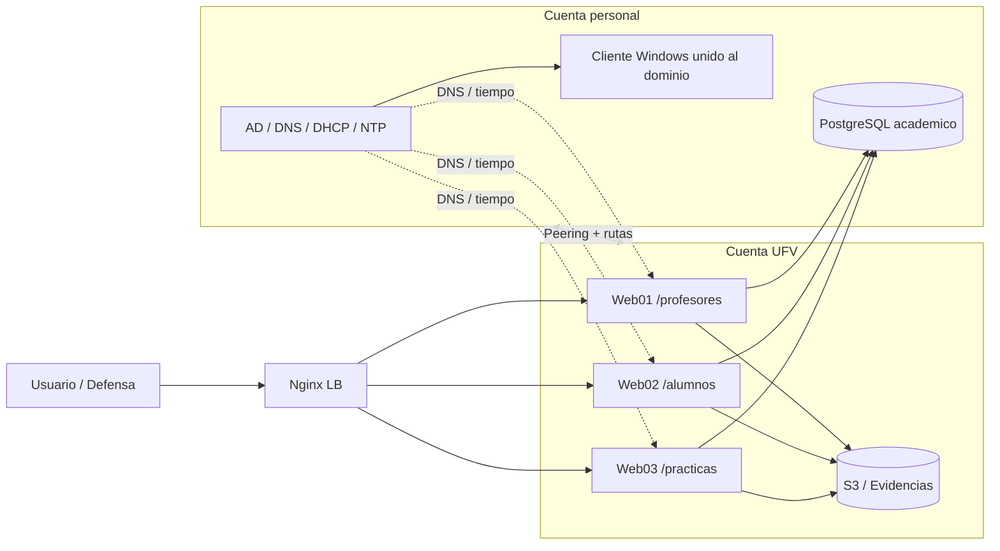

# ENTREGA FINAL — Práctica Integración de Sistemas en AWS (Grupo DT)

## Portada

- **Grupo:** DT
- **Profesor:** Alex
- **Fecha:** 22/04/2026
- **Integrantes:**
  - Alejandro — Alumno A
  - Nicolás — Alumno B
  - Mario — Alumno C
  - Gonzalo — Alumno D
  - Jesús — Alumno E

---

## 1. Arquitectura final y reparto (5 alumnos)

### 1.1 Reparto por rúbrica

- **Alumno A (Alejandro):** Windows AD/DC + DNS/DHCP/NTP + cliente Windows unido a dominio.
- **Alumno B (Nicolás):** Linux LB + Linux DB (PostgreSQL + backup/restore).
- **Alumno C (Mario):** Linux Web01 con módulo `/profesores`.
- **Alumno D (Gonzalo):** Linux Web02 con módulo `/alumnos`.
- **Alumno E (Jesús):** Linux Web03 con módulo `/practicas`.

### 1.2 Infraestructura en AWS

- **Cuenta personal (`10.0.0.0/16`):** AD, LB, PostgreSQL, cliente Windows.
- **Cuenta UFV (`10.1.0.0/16`):** Web01, Web02 y Web03.
- Integración intercuenta mediante **VPC peering + rutas cruzadas**.

### 1.3 Diagrama global de arquitectura

**Idea para explicar:** el usuario entra por el balanceador, el balanceador distribuye a los tres módulos, los módulos consumen datos compartidos y la cuenta personal aporta identidad, red y persistencia crítica.

---

## 2. Implementación técnica en repositorio

### 2.1 IaC

- `cloudformation/stack-personal.yaml`
- `cloudformation/stack-ufv.yaml`

Cobertura:
- VPC, subredes y rutas.
- Security groups por rol.
- EC2 Windows/Linux.
- EIP para instancias críticas.
- Budget mensual en cuenta personal.
- IAM Role para acceso S3 desde webservers.

### 2.2 Pipeline

- **GitHub Actions:** `.github/workflows/deploy.yml` (incluye despliegue de ambos stacks + peering + rutas).
- **Jenkins:** `jenkins/Jenkinsfile-infra`, `jenkins/Jenkinsfile-provision`, `jenkins/Jenkinsfile-webdeploy`.

### 2.3 Provisioning Ansible

- `ansible/playbooks/setup_ad_dns_ntp.yml`
- `ansible/playbooks/configure_dns_clients.yml`
- `ansible/playbooks/deploy_app.yml`
- `ansible/playbooks/update_web.yml`

Cobertura:
- AD DS, DNS, DHCP, GPO, NTP en Windows AD.
- Cliente Windows por DHCP + unión a dominio.
- Linux con NTP/DNS contra AD.
- DB `academico` con tablas de la rúbrica.
- Web por módulos (`/profesores`, `/alumnos`, `/practicas`).

---

## 3. Estado de cumplimiento por bloque

### 3.1 Infraestructura AWS base

- [x] IAM (roles para S3 en webservers)
- [x] Diseño de VPC y subredes pública/privada
- [x] Budget en cuenta personal
- [x] EC2 Windows + Linux
- [x] Security Groups

### 3.2 Windows AD

- [x] AD funcional
- [x] DNS + DHCP + NTP
- [x] Recurso CIFS para GPO de mapeo
- [x] OU + grupo + usuarios demo
- [x] GPO NoShutdown y GPO MapDrive
- [x] Cliente Windows unido a dominio

### 3.3 Componentes Linux

- [x] LB Nginx reverse proxy
- [x] 3 locations separadas a webservers distintos
- [x] PostgreSQL operativo
- [x] Modelo de datos académico completo
- [x] Backup/restore de base de datos
- [x] Integración S3 mediante IAM Role

### 3.4 Integración inter-cuenta

- [x] Peering y rutas cruzadas automatizadas
- [x] Resolución y acceso entre capas

### 3.5 DRP

- [x] Backup de PostgreSQL automatizado
- [x] Restauración validable (`academico_restore`)
- [ ] Evidencia ejecutada de backup AD
- [ ] Evidencia ejecutada de backup S3
- [ ] Evidencia de restauración en cuenta alternativa
- [ ] Evidencia de verificación funcional post-restauración

### 3.6 Memoria técnica y evidencias

- [x] Documentación técnica unificada
- [ ] Todas las capturas de evidencia aún deben adjuntarse en `CHECKLIST_EVIDENCIAS_DT.md`

---

## 4. Riesgos y plan de cierre antes de defensa

1. Completar evidencias pendientes del DRP (AD + S3 + restore cross-account).
2. Ejecutar prueba guiada de cada location con captura por alumno responsable.
3. Cerrar checklist al 100% y anexar logs de pipeline y comandos.

---

## 5. Conclusión

La solución queda corregida para un equipo de 5 alumnos con separación de responsabilidades por location y coherencia técnica entre infraestructura, automatización y aplicación. El punto pendiente para nota máxima es cerrar evidencias operativas (capturas/logs) del DRP y de la ejecución final.
