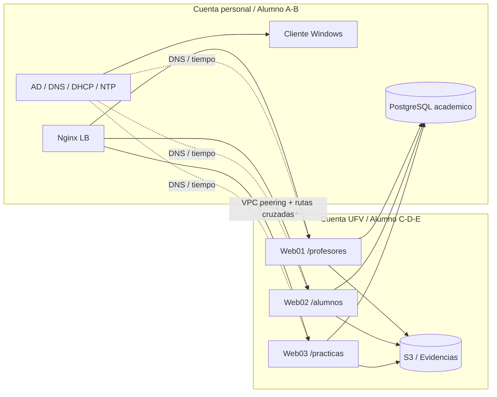
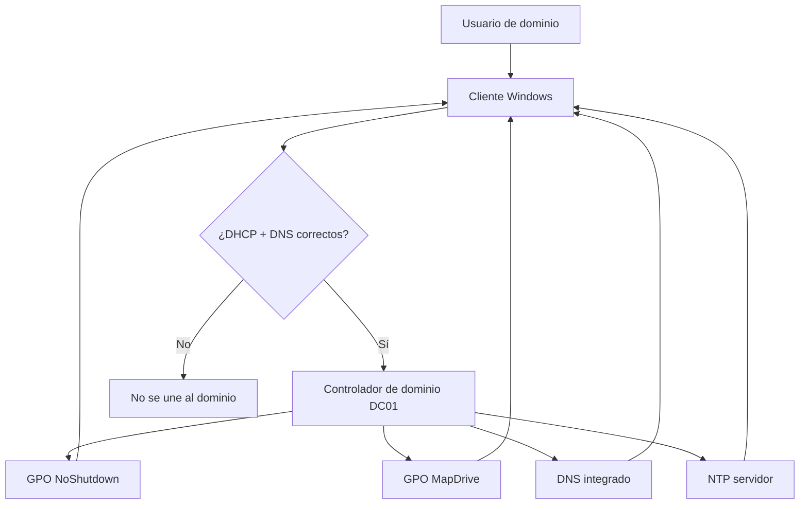
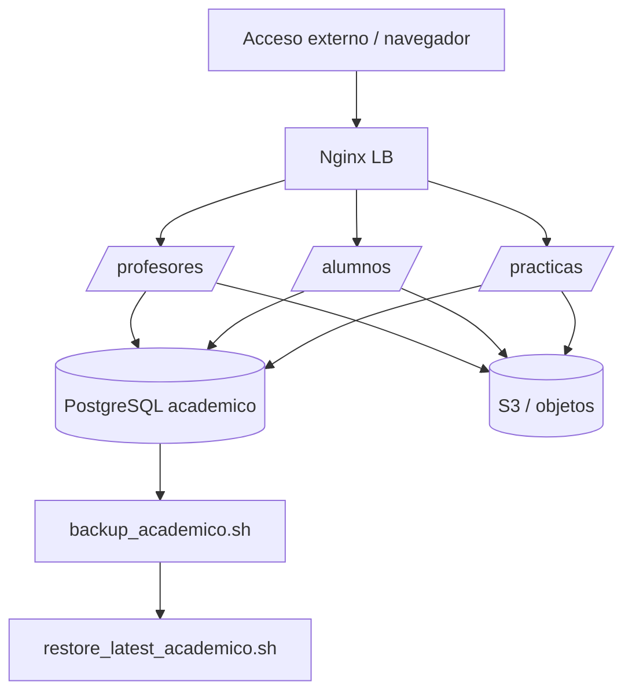

# Memoria Técnica — Integración de Sistemas en AWS (Grupo DT)

## 1. Objetivo

Implementar una arquitectura distribuida en AWS con integración real entre cuentas, combinando Windows y Linux, y automatizando despliegue y operación con IaC + CI/CD + Ansible.

## 2. Organización del equipo (5 alumnos)

- **Alumno A (Alejandro):** AD DS, DNS, DHCP, NTP, GPO, cliente Windows de dominio.
- **Alumno B (Nicolás):** Nginx Load Balancer y PostgreSQL (incluye backup/restore).
- **Alumno C (Mario):** Web01 y módulo `/profesores`.
- **Alumno D (Gonzalo):** Web02 y módulo `/alumnos`.
- **Alumno E (Jesús):** Web03 y módulo `/practicas`.

## 3. Arquitectura desplegada

### 3.1 Redes

- VPC personal: `10.0.0.0/16`
- VPC UFV: `10.1.0.0/16`
- Peering VPC entre ambas cuentas.
- Rutas cruzadas en tablas de rutas principales de cada VPC.

### 3.1.1 Diagrama técnico de red e ինտեգración

**Lectura técnica:** la cuenta personal concentra identidad, balanceo y base de datos; la cuenta UFV contiene los módulos web. El peering permite que las capas se comuniquen de forma privada y controlada.

### 3.2 Capa Windows

- DC01 Windows con AD DS.
- DNS y DHCP integrados en AD.
- NTP activo para sincronización de Linux.
- GPO NoShutdown y GPO MapDrive.
- Cliente Windows unido al dominio y validado.

### 3.2.1 Diagrama de AD y cliente de dominio

**Qué demuestra:** el Windows Server no es solo “una máquina con AD”, sino el punto de identidad y configuración del entorno. El cliente depende de DHCP, DNS, hora correcta y GPO aplicadas para funcionar como parte del dominio.

### 3.3 Capa Linux

- LB Nginx con locations por módulo:
  - `/profesores` -> Web01
  - `/alumnos` -> Web02
  - `/practicas` -> Web03
- PostgreSQL con base `academico` y tablas:
  - `asignaturas`
  - `alumnos`
  - `inscripciones`
  - `practicas`
  - `entregas`
- Webservers Linux con Node.js y Nginx local.
- Integración S3 mediante IAM Role (sin credenciales hardcodeadas en código).

### 3.3.1 Diagrama de flujo de aplicaciones y datos

**Lectura técnica:** el balanceador separa funcionalidades por location, las aplicaciones usan una base de datos común y el DRP protege tanto datos como capacidad de restauración.

## 4. Automatización

### 4.1 Infraestructura como código

- `cloudformation/stack-personal.yaml`
- `cloudformation/stack-ufv.yaml`

### 4.2 CI/CD

- GitHub Actions:
  - `.github/workflows/deploy.yml`
  - `.github/workflows/ansible-provision.yml`
- Jenkins:
  - `jenkins/Jenkinsfile-infra`
  - `jenkins/Jenkinsfile-provision`
  - `jenkins/Jenkinsfile-webdeploy`

### 4.3 Provisioning

- `ansible/playbooks/setup_ad_dns_ntp.yml`
- `ansible/playbooks/configure_dns_clients.yml`
- `ansible/playbooks/deploy_app.yml`
- `ansible/playbooks/update_web.yml`

## 5. Seguridad

- IAM por mínimo privilegio para acceso S3 desde instancias web.
- SG segmentados por rol y puerto.
- `AdminCidr` sin default abierto para obligar acceso administrativo controlado.
- Sin uso operativo de usuario root.

## 6. DRP (estado)

### 6.1 Implementado en repositorio

- Backup automático de PostgreSQL diario (`backup_academico.sh`).
- Script de restauración al último backup (`restore_latest_academico.sh`).
- Reprovisión completa vía CloudFormation + Ansible.

### 6.2 Pendiente de evidencia final

- Evidencia de backup AD (System State).
- Evidencia de backup S3.
- Restauración documentada en cuenta alternativa.
- Verificación funcional post-restauración.
- Protocolo de comunicación de incidencias entre integrantes.

## 7. Evidencias y defensa

Todas las capturas y logs deben consolidarse en:
- `documentacion/entrega-final-dt/CHECKLIST_EVIDENCIAS_DT.md`

Sin ese cierre, el trabajo técnico está implementado pero no completamente defendible en evaluación formal de rúbrica.
